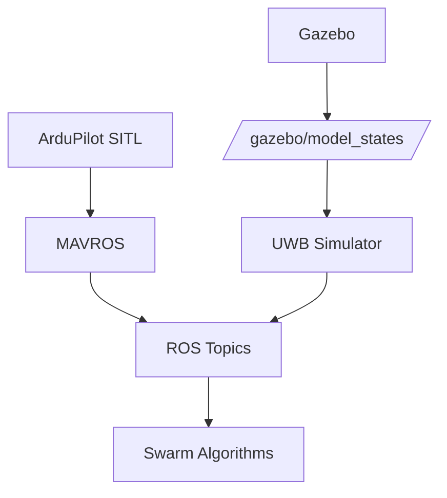

# Swarm Gazebo Simulation


A modular multi-UAV simulation framework for swarm autonomy research, combining Gazebo, ArduPilot SITL, MAVROS, and UWB-based inter-vehicle sensing.

> Package name: `nexus_swarm_sim`

## Table Of Contents

- [Overview](#overview)
- [Why This Project Exists](#why-this-project-exists)
- [Highlights](#highlights)
- [Architecture](#architecture)
- [Quick Start](#quick-start)
- [Requirements](#requirements)
- [Installation And Setup](#installation-and-setup)
  - [Setup Paths](#setup-paths)
  - [If ArduPilot Is Already Installed](#if-ardupilot-is-already-installed)
  - [If ArduPilot Is Not Installed Yet](#if-ardupilot-is-not-installed-yet)
  - [If You Do Not Need ArduPilot](#if-you-do-not-need-ardupilot)
  - [Environment Expectations](#environment-expectations)
  - [Troubleshooting Full Swarm Bringup](#troubleshooting-full-swarm-bringup)
- [Build](#build)
- [Launch Modes](#launch-modes)
- [Runtime Data Flow](#runtime-data-flow)
- [Namespaces](#namespaces)
- [Operational Checks](#operational-checks)
- [Web Dashboard](#web-dashboard)
- [Topic Layout](#topic-layout)
- [UWB Simulation Behavior](#uwb-simulation-behavior)
- [Use Cases](#use-cases)
- [Configuration](#configuration)
- [Developing Against The Package](#developing-against-the-package)
- [Additional Documentation](#additional-documentation)
- [Notes](#notes)

## Overview

`nexus_swarm_sim` provides two connected capabilities:

- full multi-vehicle simulation bringup using Gazebo, ArduPilot SITL, and MAVROS
- an optional UWB layer that publishes simulated inter-vehicle ranging data

The system is built around dynamic discovery. Vehicles are detected from `/gazebo/model_states`, and UWB links are created automatically as matching models appear.

## Why This Project Exists

Swarm autonomy research requires tightly integrated simulation of:

- vehicle dynamics
- communication middleware
- inter-agent sensing

This project provides all three in a single reproducible stack.

## Quick Start

### Full Swarm (recommended)

```bash
mkdir -p ~/nexus_swarm_sim_ws/src
cd ~/nexus_swarm_sim_ws/src

git clone https://github.com/tayfurcnr/nexus_swarm_sim.git
cd nexus_swarm_sim

bash setup_ardupilot_noetic.sh

source ~/nexus_swarm_sim_ws/devel/setup.bash

roslaunch nexus_swarm_sim full_swarm.launch num_drones:=3
```

### Fast Non-SITL Start

```bash
mkdir -p ~/catkin_ws/src
cd ~/catkin_ws/src
git clone https://github.com/tayfurcnr/nexus_swarm_sim.git
cd ~/catkin_ws

python3 -m pip install -r src/nexus_swarm_sim/requirements.txt
catkin_make
source devel/setup.bash

roslaunch nexus_swarm_sim models_only.launch num_drones:=3
```

## Highlights

- Multi-vehicle Gazebo bringup with configurable swarm size
- Per-vehicle MAVROS namespaces
- ArduPilot SITL integration
- Optional UWB range and raw-signal simulation
- Headless and GUI launch support
- Lightweight non-SITL and UWB-only modes for testing

## Architecture

The package is organized around two layers.

### Simulation Bringup

- Gazebo world loading
- vehicle spawning
- ArduPilot SITL processes
- MAVROS connectivity

### UWB Simulation

- dynamic vehicle discovery from `/gazebo/model_states`
- per-vehicle UWB publishers
- probabilistic LOS/NLOS behavior
- latency, dropout, and outlier modeling

Default runtime naming:

| Parameter | Default |
|---|---|
| `vehicle_model` | `iris` |
| `drone_prefix` | `nexus` |
| Generated names | `nexus1`, `nexus2`, `nexus3`, ... |

Runtime sketch:

```text
ArduPilot SITL -> MAVROS -> ROS topics -> swarm logic
                  ^
                  |
Gazebo -> /gazebo/model_states -> UWB Simulator -> /<drone_id>/uwb/*
```

Mermaid view:



## Requirements

| Component | Status For `full_swarm.launch` |
|---|---|
| Ubuntu 20.04 | Required |
| ROS Noetic | Required |
| Gazebo 11 Classic | Required |
| MAVROS | Required |
| ArduPilot SITL | Required |
| `ardupilot_gazebo` | Required |
| Python packages from `requirements.txt` | Required |

For a full local setup flow, see [setup_ardupilot_noetic.sh](setup_ardupilot_noetic.sh).

## Installation And Setup

### Setup Paths

There are three practical ways to use this repository.

| Situation | Recommended Path | Recommended Launch |
|---|---|---|
| You already have ArduPilot and `ardupilot_gazebo` | Build this package and run full stack | `full_swarm.launch` |
| You do not have ArduPilot dependencies yet | Run setup script first | `full_swarm.launch` after setup |
| You do not want ArduPilot | Use simplified modes | `models_only.launch` or `uwb_only.launch` |

Expected workspaces:

- setup script default workspace: `~/nexus_swarm_sim_ws/src/nexus_swarm_sim`
- manual catkin workspace example: `~/catkin_ws/src/nexus_swarm_sim`

You can override the script workspace if needed:

```bash
WORKSPACE_DIR=~/catkin_ws bash setup_ardupilot_noetic.sh
```

### If ArduPilot Is Already Installed

Use this path if these directories already exist:

- `~/ardupilot`
- `~/ardupilot_gazebo`

Basic checks:

```bash
ls ~/ardupilot
ls ~/ardupilot_gazebo
ls ~/ardupilot/Tools/autotest/sim_vehicle.py
rospack find mavros
```

If `ls ~/ardupilot_gazebo` fails, do not use `full_swarm.launch` yet.
Use one of the following instead:

- install the missing dependency stack with `bash setup_ardupilot_noetic.sh`
- use `models_only.launch` until ArduPilot dependencies are ready
- use `uwb_only.launch` for minimal UWB-only testing

Expected state:

- ArduPilot SITL is built
- `ardupilot_gazebo` is built
- MAVROS is installed

Then build this package in your catkin workspace:

```bash
python3 -m pip install -r requirements.txt
catkin_make
source devel/setup.bash
```

Recommended main launch:

```bash
roslaunch nexus_swarm_sim full_swarm.launch
```

### If ArduPilot Is Not Installed Yet

Use the setup script:

```bash
bash setup_ardupilot_noetic.sh
```

The script prepares:

- ROS Noetic dependencies
- MAVROS
- Python packages from `requirements.txt`
- GeographicLib datasets
- ArduPilot source and SITL build
- `ardupilot_gazebo`
- a catkin workspace for this package

After it finishes, make sure ArduPilot tools are available on your shell `PATH`:

```bash
echo 'export PATH=$PATH:$HOME/ardupilot/Tools/autotest' >> ~/.bashrc
echo 'export PATH=$PATH:$HOME/ardupilot/Tools' >> ~/.bashrc
source ~/.bashrc
```

`requirements.txt` in this repository contains only direct `pip` dependencies used by the repository's Python code.

Then source the generated workspace:

```bash
cd ~/nexus_swarm_sim_ws
source devel/setup.bash
```

### If You Do Not Need ArduPilot

If you only want Gazebo visuals or UWB behavior, you do not need the full flight stack.

Use:

- `models_only.launch` for real Gazebo models without SITL
- `uwb_only.launch` for a minimal UWB smoke test

Examples:

```bash
roslaunch nexus_swarm_sim models_only.launch gui:=true headless:=false num_drones:=3 drone_prefix:=nexus
```

```bash
roslaunch nexus_swarm_sim uwb_only.launch num_drones:=3 drone_prefix:=nexus
```

### Environment Expectations

`full_swarm.launch` assumes:

- `~/ardupilot` exists
- `~/ardupilot_gazebo` exists
- `sim_vehicle.py` is available from the ArduPilot tree
- MAVROS is installed

If these are not true, use `models_only.launch` or `uwb_only.launch` until the full stack is ready.

### Troubleshooting Full Swarm Bringup

Check these first:

```bash
ls ~/ardupilot/Tools/autotest/sim_vehicle.py
ls ~/ardupilot_gazebo
rospack find mavros
```

If `ls ~/ardupilot_gazebo` returns `No such file or directory`, the `ardupilot_gazebo` dependency is missing. In that case:

- run `bash setup_ardupilot_noetic.sh`, or
- install `ardupilot_gazebo` manually, or
- stay on `models_only.launch` / `uwb_only.launch` until the dependency is available

Then confirm your environment is sourced:

```bash
source /opt/ros/noetic/setup.bash
source devel/setup.bash
```

If you need to isolate SITL problems, start with:

```bash
roslaunch nexus_swarm_sim single_vehicle_sitl.launch
```

## Build

Inside your catkin workspace:

```bash
python3 -m pip install -r requirements.txt
catkin_make
source devel/setup.bash
```

## Launch Modes

### `full_swarm.launch`

Main end-to-end launch.

Starts:

- Gazebo
- multiple ArduPilot SITL instances
- MAVROS per vehicle
- `/uwb_simulator`

Example:

```bash
roslaunch nexus_swarm_sim full_swarm.launch gui:=true headless:=false num_drones:=3 drone_prefix:=nexus
```

Headless example:

```bash
roslaunch nexus_swarm_sim full_swarm.launch gui:=false headless:=true num_drones:=2 drone_prefix:=nexus
```

### `single_vehicle_sitl.launch`

Single-vehicle ArduPilot validation mode.

```bash
roslaunch nexus_swarm_sim single_vehicle_sitl.launch
```

### `models_only.launch`

Gazebo-only visual simulation with real drone models, without ArduPilot SITL.

```bash
roslaunch nexus_swarm_sim models_only.launch gui:=true headless:=false num_drones:=3 drone_prefix:=nexus
```

### `uwb_only.launch`

Minimal smoke-test mode with dummy models and only the UWB side enabled.

```bash
roslaunch nexus_swarm_sim uwb_only.launch num_drones:=3 drone_prefix:=nexus
```

## What You Get After Launch

- Multiple drones spawned in Gazebo
- Independent MAVROS instances per drone
- Live UWB range topics between drones
- Fully namespaced swarm-ready ROS graph

## Runtime Data Flow

Core runtime flow:

```text
ArduPilot SITL -> MAVROS -> ROS topics -> UWB Simulator / swarm consumers
```

Per vehicle:

```text
SITL instance -> MAVROS node -> namespace (/nexusX)
```

Gazebo contribution:

```text
Gazebo -> /gazebo/model_states -> UWB Simulator -> /<drone_id>/uwb/*
```

## Namespaces

Each drone runs in its own namespace. This is critical for any multi-vehicle workflow.

Examples:

- `/nexus1/`
- `/nexus2/`
- `/nexus3/`

Typical per-vehicle topics:

- `/nexus1/mavros/state`
- `/nexus1/mavros/local_position/pose`
- `/nexus1/uwb/range`
- `/nexus1/uwb/raw_signal`

## Operational Checks

Monitor tool:

```bash
rosrun nexus_swarm_sim swarm_uwb_monitor.py
```

Useful commands:

```bash
rostopic echo /nexus1/mavros/state
rostopic echo /nexus1/uwb/range
rostopic list | grep /uwb/
rosnode list
```

## Web Dashboard

All main launch modes can start a lightweight 2D dashboard.

Default behavior:

- `headless:=true` -> dashboard defaults to enabled
- `headless:=false` -> dashboard defaults to disabled
- `dashboard:=true/false` always overrides the default

- Default URL: `http://localhost:8787`
- Shows active vehicles, namespaces, host IP, FCU URL, and recent UWB links
- Uses `docs/nexus.svg` with labels such as `NEXUS #1`, `NEXUS #2`, and so on

You can override the bind address or port from launch:

```bash
roslaunch nexus_swarm_sim full_swarm.launch headless:=true
```

```bash
roslaunch nexus_swarm_sim full_swarm.launch gui:=true headless:=false dashboard:=true
```

## Topic Layout

### MAVROS Topics

Each vehicle uses its own namespace:

- `/<drone_id>/mavros/state`
- `/<drone_id>/mavros/local_position/pose`
- `/<drone_id>/mavros/global_position/global`

### UWB Topics

Each discovered vehicle publishes:

| Topic | Message Type | Description |
|---|---|---|
| `/<drone_id>/uwb/range` | `UwbRange` | Processed UWB distance estimates |
| `/<drone_id>/uwb/raw_signal` | `RawUWBSignal` | Raw signal-level UWB simulation output |

## UWB Simulation Behavior

The UWB layer includes:

- dynamic link creation
- distance-dependent dropout
- latency with jitter
- random outliers
- probabilistic LOS/NLOS behavior
- per-pair throttling using `update_rate_hz`

The simulator models DW3000-like behavior and publishes per-vehicle topics using the active drone namespace.

## Use Cases

This package is suitable for:

- relative localization
- swarm formation control
- multi-agent SLAM
- GPS-denied environment experiments
- inter-vehicle sensing research

## Configuration

Main simulator parameters live in [config/uwb_simulator.yaml](config/uwb_simulator.yaml).

Important simulator parameters:

- `drone_prefix`
- `model_prefix`
- `vehicle_model`
- `update_rate_hz`
- `pub_topic_prefix`
- `max_twr_freq`
- dropout, outlier, and NLOS tuning parameters

Common launch arguments:

- `num_drones`
- `drone_prefix`
- `vehicle_model`
- `gui`
- `headless`

## Developing Against The Package

If you want to consume UWB data in another ROS node, subscribe to `/<drone_id>/uwb/range`.

```python
import rospy
from nexus_swarm_sim.msg import UwbRange


def range_callback(msg):
    rospy.loginfo(
        f"Link {msg.src_id} -> {msg.dst_id}: {msg.distance_3d:.3f} m (los={msg.los})"
    )


rospy.init_node("my_localization_node")
rospy.Subscriber("/nexus1/uwb/range", UwbRange, range_callback)
rospy.spin()
```

## Additional Documentation

- [launch/LAUNCHES.md](launch/LAUNCHES.md)
- [examples/HOW_TO_RUN.md](examples/HOW_TO_RUN.md)

## Notes

- Gazebo Classic and related ROS packages are deprecated upstream, but this project still targets ROS Noetic + Gazebo 11 because that is the current environment.
- Use `headless:=true` for clean automated or lightweight runtime checks.
