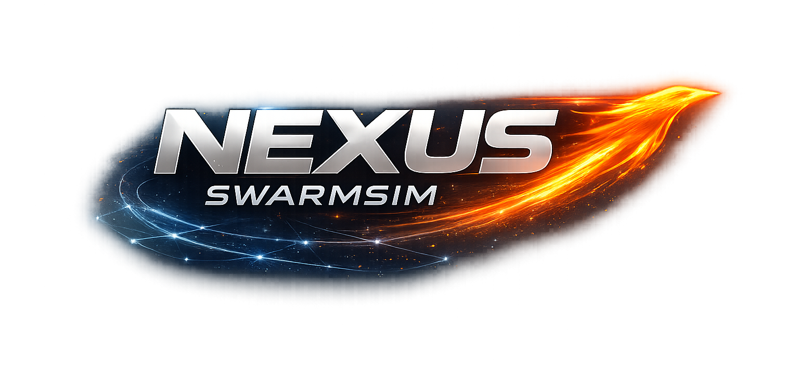

# Nexus Swarm Sim




`nexus_swarm_sim` is a ROS Noetic and Gazebo 11 package for multi-UAV swarm simulation. It combines Gazebo-based vehicle bringup, ArduPilot SITL, MAVROS integration, and a built-in UWB simulation layer in a single development workflow.

The repository supports two practical operating styles:
- full ArduPilot-backed swarm simulation
- lighter non-SITL modes for smoke testing, visualization, and UWB-focused development

## Table Of Contents

- [Key Capabilities](#key-capabilities)
- [Quick Start](#quick-start)
- [Primary Launch Modes](#primary-launch-modes)
- [Runtime Summary](#runtime-summary)
- [Requirements](#requirements)
- [Documentation Map](#documentation-map)
- [Operational Notes](#operational-notes)

## Key Capabilities

- Multi-vehicle Gazebo bringup with configurable swarm size
- ArduPilot SITL integration for vehicle-level flight simulation
- MAVROS bridges under per-vehicle namespaces
- Dynamic UWB simulation driven by `/gazebo/model_states`
- Lightweight launch modes for staged validation and dependency isolation

## Quick Start

### Full Stack

```bash
mkdir -p ~/nexus_swarm_sim_ws/src
cd ~/nexus_swarm_sim_ws/src
git clone https://github.com/tayfurcnr/nexus_swarm_sim.git
cd nexus_swarm_sim
bash setup_ardupilot_noetic.sh
cd ~/nexus_swarm_sim_ws
source devel/setup.bash
roslaunch nexus_swarm_sim full_swarm.launch num_drones:=3
```

Dashboard is available at `http://localhost:8787` during `full_swarm.launch`.

### Non-SITL Bringup

```bash
mkdir -p ~/nexus_swarm_sim_ws/src
cd ~/nexus_swarm_sim_ws/src
git clone https://github.com/tayfurcnr/nexus_swarm_sim.git
cd ~/nexus_swarm_sim_ws
python3 -m pip install -r src/nexus_swarm_sim/requirements.txt
catkin_make
source devel/setup.bash
roslaunch nexus_swarm_sim models_only.launch num_drones:=3
```

## Primary Launch Modes

| Launch | Purpose |
|---|---|
| `uwb_only.launch` | Minimal Gazebo and UWB smoke test without ArduPilot |
| `models_only.launch` | Multi-model Gazebo visualization without SITL |
| `single_vehicle_sitl.launch` | Single-vehicle end-to-end ArduPilot validation |
| `full_swarm.launch` | Full multi-vehicle swarm bringup |

Recommended validation order for a new machine:
1. `uwb_only.launch`
2. `models_only.launch`
3. `single_vehicle_sitl.launch`
4. `full_swarm.launch`

## Runtime Summary

| Component | Role |
|---|---|
| Gazebo | world loading, model spawning, physics, and visualization |
| ArduPilot SITL | per-vehicle flight controller simulation |
| MAVROS | ROS bridge for vehicle communication |
| UWB simulator | inter-vehicle ranging and signal simulation |

Default naming:

| Parameter | Default |
|---|---|
| `vehicle_model` | `iris` |
| `drone_prefix` | `nexus` |
| Generated names | `nexus1`, `nexus2`, `nexus3`, ... |

## Requirements

| Component | Status for `full_swarm.launch` |
|---|---|
| Ubuntu 20.04 | Required |
| ROS Noetic | Required |
| Gazebo 11 Classic | Required |
| MAVROS | Required |
| ArduPilot SITL | Required |
| `ardupilot_gazebo` | Required |
| Python packages from `requirements.txt` | Required |

## Documentation Map

Use the repository documents by purpose:

- [INSTALL.md](INSTALL.md): complete installation flow, dependency recovery, validation checks, and bringup order
- [LAUNCHES.md](launch/LAUNCHES.md): launch entry points, examples, defaults, and intended usage
- [setup_ardupilot_noetic.sh](setup_ardupilot_noetic.sh): automated setup for the full ArduPilot-backed environment

## Operational Notes

- The setup script installs ArduPilot into `~/ardupilot` and `ardupilot_gazebo` into `~/ardupilot_gazebo`.
- The package itself is expected to live inside a catkin workspace such as `~/nexus_swarm_sim_ws/src/nexus_swarm_sim`.
- On a new machine, prefer the setup script unless you intentionally want a non-SITL workflow.
