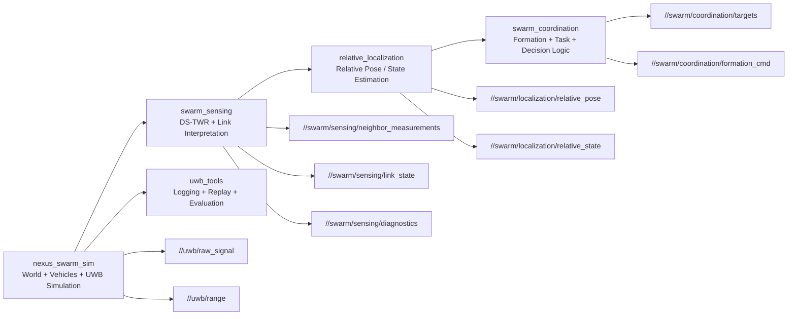

# Downstream Package Plan

## Purpose

This document defines the recommended package split around `nexus_swarm_sim`.

The main architectural rule is:

- `nexus_swarm_sim` generates the simulated world and UWB-facing data
- downstream packages interpret, estimate, and decide

This separation keeps the simulator reusable and reduces refactoring later when
simulated sources are replaced with real hardware sources.

## Core Package Boundary

- `nexus_swarm_sim`
  - owns Gazebo world setup
  - owns vehicle spawning and SITL bringup
  - owns simulated UWB publication
  - owns debug, monitoring, and simulation-time tooling
- downstream packages
  - own signal interpretation
  - own range extraction
  - own localization
  - own swarm coordination and autonomy

## Recommended Package Split

### `nexus_swarm_sim`

Responsibilities:

- Gazebo and world setup
- ArduPilot SITL integration
- MAVROS launch integration
- simulated `UwbRange` publication
- simulated `RawUWBSignal` publication
- LOS/NLOS and channel-effect simulation
- runtime dashboard and monitor tools

### `swarm_sensing`

Responsibilities:

- subscribe to `/<vehicle_ns>/uwb/raw_signal`
- reconstruct DS-TWR exchanges
- detect incomplete or degraded exchanges
- derive range-oriented outputs from low-level UWB signal messages
- publish processed link results for downstream estimation

Suggested outputs:

- `/<vehicle_ns>/swarm/sensing/neighbor_measurements`
- `/<vehicle_ns>/swarm/sensing/link_state`
- `/<vehicle_ns>/swarm/sensing/exchange_status`
- `/<vehicle_ns>/swarm/sensing/diagnostics`
- `/<vehicle_ns>/swarm/sensing/stats`

### `relative_localization`

Responsibilities:

- consume processed UWB outputs
- consume vehicle state from MAVROS and related topics
- estimate relative positions or relative state between vehicles
- publish relative pose/state outputs for coordination layers

Suggested outputs:

- `/<vehicle_ns>/swarm/localization/relative_pose`
- `/<vehicle_ns>/swarm/localization/relative_state`
- `/<vehicle_ns>/swarm/localization/quality`

### `swarm_coordination`

Responsibilities:

- consume localization outputs
- consume mission or operator goals
- run formation, coordination, and task-level decision logic
- publish vehicle-level commands or targets

Suggested outputs:

- `/<vehicle_ns>/swarm/coordination/targets`
- `/<vehicle_ns>/swarm/coordination/formation_cmd`
- per-vehicle command topics

### `uwb_tools`

Responsibilities:

- logging helpers
- replay helpers
- offline evaluation scripts
- simulated-vs-ground-truth comparison tooling
- plotting and diagnostics

## Mermaid Overview

## Data Flow Summary

1. `nexus_swarm_sim` publishes simulated UWB and vehicle-context data.
2. `swarm_sensing` turns low-level UWB traffic into usable sensing and link outputs.
3. `relative_localization` turns those outputs into relative state estimates.
4. `swarm_coordination` consumes those estimates to make swarm-level decisions.
5. `uwb_tools` supports replay, inspection, and offline evaluation across the stack.

## Near-Term Recommendation

If only one downstream package is created first, it should be:

- `swarm_sensing`

Reason:

- it is the most natural first boundary after the simulator
- it allows `RawUWBSignal` consumers to evolve outside the simulation package
- it preserves a clean path toward later real-hardware-backed ranging inputs
