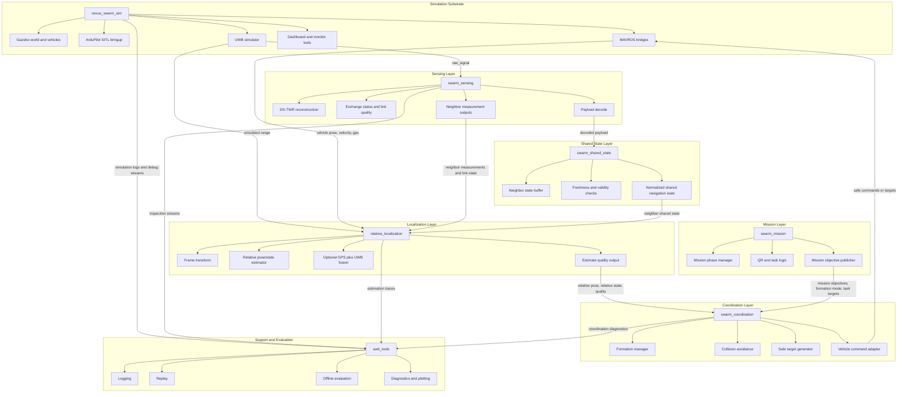

# System Architecture

## Purpose

This document describes the recommended high-level system architecture around
`nexus_swarm_sim` and the downstream packages that should consume its outputs.

The main architectural rule is:

- `nexus_swarm_sim` owns simulation, vehicle bringup, and UWB-facing data generation
- downstream packages own interpretation, estimation, coordination, and mission logic

This boundary keeps the simulator reusable and preserves a clean path toward
future sim-to-real migration.

## Package Roles

### `nexus_swarm_sim`

Owns:

- Gazebo world setup
- ArduPilot SITL integration
- MAVROS launch and namespace organization
- simulated `RawUWBSignal` publication
- simulated `UwbRange` publication
- LOS/NLOS and channel-effect simulation
- operator-facing dashboard and simulation-time tools

### `swarm_sensing`

Owns:

- low-level UWB link interpretation
- DS-TWR reconstruction
- link quality and exchange status interpretation
- payload decoding from UWB frames

### `swarm_shared_state`

Owns:

- normalization of payload-carried neighbor state
- freshness checks
- validity checks
- a stable downstream representation of neighbor-shared navigation data

### `relative_localization`

Owns:

- frame conversion and alignment
- relative pose and relative state estimation
- optional fusion of payload-carried GPS/state with UWB-derived ranging outputs
- quality scoring for relative estimates

### `swarm_coordination`

Owns:

- formation control
- collision avoidance
- safe target generation
- vehicle-level coordination outputs

### `swarm_mission`

Owns:

- mission phases
- QR- and task-driven mission logic
- high-level task objectives
- mission-to-coordination intent generation

### `uwb_tools`

Owns:

- logging
- replay
- offline evaluation
- plotting and diagnostics

## Data Flow

The intended data flow is:

1. `nexus_swarm_sim` publishes simulated UWB, vehicle, and debug data.
2. `swarm_sensing` interprets UWB link traffic and decodes frame payloads.
3. `swarm_shared_state` turns decoded payloads into stable neighbor state.
4. `relative_localization` estimates relative state from local state, neighbor state, and optional UWB-derived measurements.
5. `swarm_coordination` consumes relative state and generates safe formation-aware targets.
6. `swarm_mission` supplies high-level task objectives to the coordination layer.
7. `uwb_tools` supports logging, replay, and evaluation across the stack.

## Mermaid Overview

## Responsibility Boundary

The intended responsibility split is:

- `nexus_swarm_sim`: produce simulated world state and sensor-facing outputs
- `swarm_sensing`: interpret low-level UWB traffic
- `swarm_shared_state`: normalize neighbor-broadcast state
- `relative_localization`: estimate relative geometry and motion
- `swarm_coordination`: decide safe coordinated motion
- `swarm_mission`: decide what the swarm should do
- `uwb_tools`: inspect and evaluate the stack

## Design Notes

- `RawUWBSignal` should not be consumed directly by localization, coordination, or mission packages.
- Payload decoding should happen before localization.
- Collision avoidance belongs to `swarm_coordination`, not to `relative_localization`.
- Mission logic should not bypass the coordination layer and command vehicles directly.
- `uwb_tools` should remain a support package rather than a runtime control dependency.
