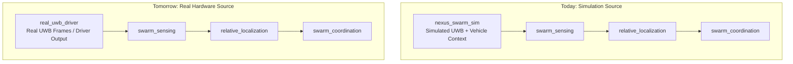

# Downstream Packages

This folder describes the packages that are expected to live outside
`nexus_swarm_sim`.

The purpose of these documents is to keep the simulator package focused on:

- world generation
- vehicle bringup
- UWB simulation
- simulation-time tooling

and to keep downstream algorithm packages focused on:

- signal interpretation
- sensing
- localization
- coordination
- replay and analysis

## Package List

- [swarm_sensing.md](swarm_sensing.md): first downstream package, responsible for turning low-level UWB traffic into usable swarm sensing outputs
- [relative_localization.md](relative_localization.md): relative position/state estimation package built on processed sensing outputs
- [swarm_coordination.md](swarm_coordination.md): higher-level formation, coordination, and decision package
- [uwb_tools.md](uwb_tools.md): logging, replay, plotting, and evaluation tooling

## Recommended Build Order

1. `swarm_sensing`
2. `relative_localization`
3. `swarm_coordination`
4. `uwb_tools`

## Design Rule

`nexus_swarm_sim` should publish data.
Downstream packages should interpret and use that data.

## Sim-to-Real Transition

The intended migration path is that only the lowest data source changes.
The downstream stack should stay as stable as possible.

Key idea:

- simulation and real hardware should feed the same downstream processing chain
- `swarm_sensing` is the main bridge layer between raw UWB data sources and the rest of the swarm stack
